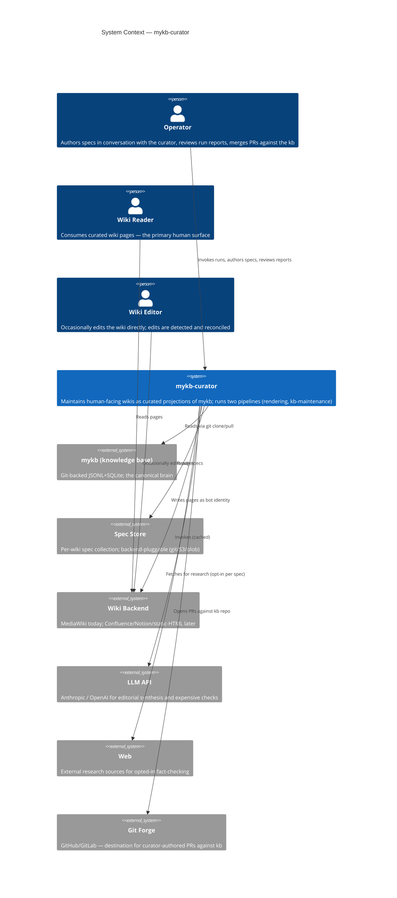
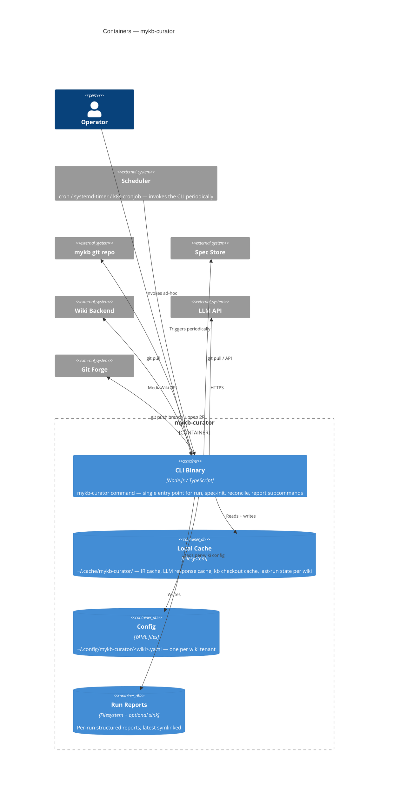
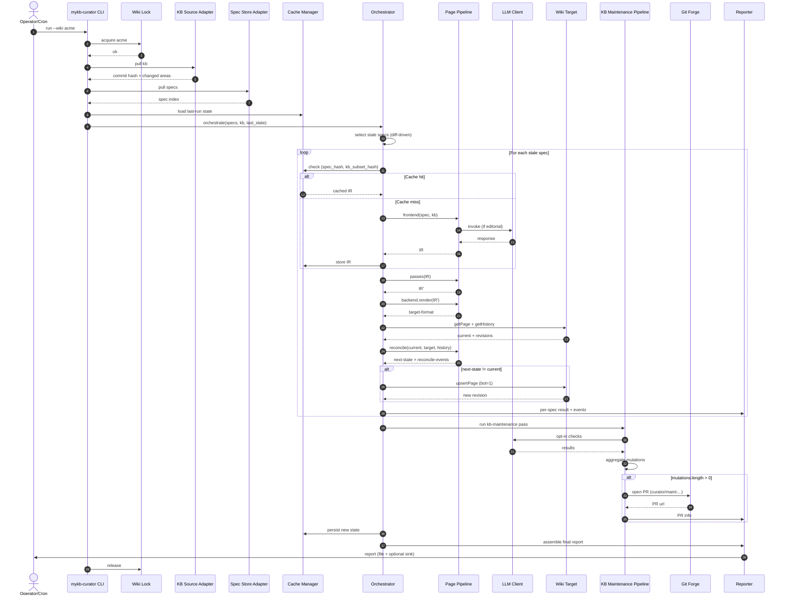

# mykb-curator — DESIGN

**Status:** Draft v0.1
**Date:** 2026-05-15
**Related:** [mykb](https://github.com/vilosource/mykb) (canonical brain)

---

## 0. TL;DR

`mykb-curator` is a separate project that maintains human-facing wikis as **curated, continuously-updated projections of a mykb brain**. mykb stays machine-shaped (LLM agent reads/writes JSONL+SQLite). The wiki is the human-shaped surface readers consume. A curator process bridges them: reads specs that declare what each wiki page should be, reads kb, synthesises pages, pushes them to the wiki, and reconciles human edits when they happen.

Architecturally it is **three pluggable backends** (KB-source, Spec-store, Wiki-target) wrapped around **two pipelines** (Page Rendering and KB Maintenance), each built as a **compiler-style pipeline** (frontend → IR → passes → backend) where **intelligence is localised to the frontend** and the rest is deterministic and testable.

---

## 1. Purpose & Background

### 1.1 The problem

mykb is excellent for an LLM agent: tight schema, JSONL on disk, SQLite index, semantic ops (`kb add fact`, `kb load`, etc.). It is terrible for a human to browse. There is no table of contents, no narrative, no cross-cutting hub pages. Readers cannot show a colleague "look at our Azure infrastructure" — they can show a `kb load` dump.

A one-shot datamining export from a real kb into a MediaWiki `Azure_Infrastructure` hub page (areas + workspaces synthesised into a curated landing page with sections, sidebars, and runbook links) is empirical proof that this kind of synthesis produces an artefact that is genuinely useful for humans. But it was a one-shot export. The moment it shipped, drift began.

### 1.2 The opportunity

Make the synthesis **continuous and structural**: a curator process that owns the human-facing wikis as derived views of the kb, refreshes them as kb evolves, and reconciles human contributions back into the kb pipeline.

### 1.3 Why a separate project

mykb is the brain (storage + agent interface). The curator is a *client* of mykb that happens to be ambitious. Keeping it separate gives:

- Independent release cadence
- Independent dependency surface (LLM SDK, wiki SDKs, mermaid renderers — none belong in mykb core)
- Composability: any mykb instance, any wiki, by config — not by branch
- Clean blast-radius story: the curator runs read-only against the kb (PR-mode for any writes); cannot corrupt the brain even when buggy

---

## 2. System Overview

```
              Spec (intent: "this page is the Azure hub, cover X/Y/Z")
                                  │
                                  ▼
            ┌──────────────────────────────────────────┐
            │            mykb-curator                  │
            │   ┌────────────────────────────────┐     │
   mykb ───▶│   │   Page Rendering Pipeline       │────▶│──▶ Wiki page
            │   │   spec → IR → passes → backend  │     │
            │   └────────────────────────────────┘     │
            │                                          │
            │   ┌────────────────────────────────┐     │
   mykb ───▶│   │   KB Maintenance Pipeline       │────▶│──▶ PR against kb
            │   │   checks → mutations → PR       │     │
            │   └────────────────────────────────┘     │
            └──────────────────────────────────────────┘
```

Two orthogonal pipelines, both driven from the kb, both producing reviewable outputs. Wikis are derived. The kb stays canonical.

---

## 3. Principles & Constraints

> Architectural principles (this section) cover *what* the system is. Engineering principles — SOLID, TDD, the four-level testing pyramid, the design-pattern map — cover *how* it is built. See [`engineering-principles.md`](engineering-principles.md) for the engineering north star; it is non-negotiable for every PR in this repo.

### 3.1 Architectural principles

1. **mykb is the source of truth.** Wikis are projections. If they disagree, the kb wins (modulo curator-detected human edits, which are reconciled, not silently accepted).
2. **Intelligence is *located*, not opt-in.** LLM lives at the frontend of each pipeline. Passes and backends are deterministic. The system has one clear creative authority and the rest is verifiable transformation.
3. **Specs are intent, not blueprint.** A spec describes *what* the page must accomplish and *what topics it must cover*; the frontend (with kb access and editorial judgement) decides *how*. Specs stay small because the frontend is intelligent.
4. **Determinism is the default; intelligence is opt-in beyond the frontend.** Cheap deterministic passes/checks run every cycle; expensive LLM-mediated checks gate behind explicit spec/area annotations. Cost scales with opt-ins, not with curator runs.
5. **Soft read-only at the wiki.** Humans *can* edit; the curator detects, reconciles, and explains via the run report. Wiki edits are signals that the kb is missing something — turn drift into kb pressure.
6. **PR-mode for kb writes.** The curator never commits to the kb directly. It opens branches/PRs against the kb git repo. Humans review and merge.
7. **The IR is the portability contract.** A spec that produces IR which renders cleanly on MediaWiki today will render cleanly on Confluence tomorrow. Portability is a structural property, not a hope.
8. **Per-tenant isolation by default.** Each wiki has its own config, spec store, identity, and credentials. The brain is shared (one `~/.mykb`) but every spec carries an explicit `include:` filter so per-page scope is auditable.

### 3.2 Non-negotiable constraints

- **Verification-first.** Curator outputs must mark verified vs unverified content; never present synthesised claims as facts without provenance.
- **Multi-tenant data separation.** Spec stores per tenant; no cross-tenant data flow without explicit re-export. Per-tenant credentials.
- **Commit message hygiene.** PRs the curator opens against kb must follow project commit-message conventions; no AI attribution in commits or PR bodies unless the receiving project explicitly opts in.

### 3.3 Quality attributes (ranked)

| Attribute | Priority | How achieved |
|---|---|---|
| Don't lose human work | Critical | Two-zone page model + run report + PR-mode kb writes |
| Don't corrupt kb | Critical | PR-mode; read-only kb adapter by default |
| Observability | High | Structured run report every cycle; per-block diff trail |
| Cost predictability | High | LLM opt-in per spec/area; cache by (spec_hash, kb_hash) |
| Portability across wikis | High | IR as lingua franca; markdown-with-shortcodes spec language |
| Testability | High | Deterministic core; LLM at edges with cached fixtures |
| Throughput | Medium | Diff-driven runs; only re-render specs whose inputs changed |

---

## 4. C4 Diagrams

The C4 model: System Context → Containers → Components → Code, increasing detail at each level.

### 4.1 Level 1 — System Context

Who and what touches the curator system.



### 4.2 Level 2 — Containers

The deployable units inside `mykb-curator`. v1 is a single CLI invoked by a scheduler; no long-lived daemon. Simpler than it sounds; sufficient.



### 4.3 Level 3 — Components

Zoom into the CLI binary.

```mermaid
C4Component
    title Components — inside the mykb-curator CLI

    Container_Ext(config, "Config")
    Container_Ext(cache, "Local Cache")
    Container_Ext(reports, "Run Reports")
    System_Ext(mykb)
    System_Ext(spec_store)
    System_Ext(wiki)
    System_Ext(llm)
    System_Ext(forge)

    Container_Boundary(cli, "mykb-curator CLI") {
        Component(entry, "Entry / CLI Parser", "Subcommand dispatch (run, spec init, reconcile, report)")
        Component(loader, "Config Loader", "Loads + validates per-wiki YAML")
        Component(kb_adapter, "KB Source Adapter", "Strategy: git-clone / local / v2-daemon")
        Component(spec_adapter, "Spec Store Adapter", "Strategy: git / s3 / az-blob / local-fs")
        Component(spec_engine, "Spec Engine", "Parse frontmatter, validate schema, check reference integrity, index")
        Component(orchestrator, "Orchestrator", "Diff-driven selection of stale specs; pipeline dispatch")
        Component(rendering, "Page Rendering Pipeline", "Frontend → IR → Passes → Backend → Reconciler")
        Component(maintenance, "KB Maintenance Pipeline", "Check-frontends → MutationIR → Passes → PR-backend")
        Component(wiki_adapter, "Wiki Target Adapter", "Strategy: MediaWiki / Confluence / static / markdown")
        Component(reconciler, "Reconciler", "Two-zone rules, human-edit detection, atomic upsert")
        Component(cache_mgr, "Cache Manager", "Hash keys (spec_hash, source_kb_hash); invalidation; persistence")
        Component(llm_client, "LLM Client", "Cached, rate-limited, model-pinned; opt-in per pass/frontend")
        Component(reporter, "Run Reporter", "Assembles structured report; writes file; optional sink (Slack/email)")
        Component(lock, "Wiki Lock", "Per-wiki file lock to prevent concurrent runs")
    }

    Rel(entry, loader, "loads config")
    Rel(loader, config, "reads")
    Rel(entry, lock, "acquires per-wiki")
    Rel(entry, orchestrator, "starts run")
    Rel(orchestrator, kb_adapter, "pulls kb snapshot")
    Rel(orchestrator, spec_adapter, "pulls specs")
    Rel(orchestrator, spec_engine, "parses/validates")
    Rel(orchestrator, cache_mgr, "consults last-run state")
    Rel(orchestrator, rendering, "dispatches per stale spec")
    Rel(orchestrator, maintenance, "dispatches kb-maintenance pass")
    Rel(rendering, llm_client, "frontend invokes")
    Rel(rendering, cache_mgr, "checks IR cache")
    Rel(rendering, wiki_adapter, "fetch current, push new")
    Rel(rendering, reconciler, "two-zone reconcile")
    Rel(wiki_adapter, wiki, "API")
    Rel(maintenance, llm_client, "opt-in LLM checks")
    Rel(maintenance, forge, "opens PR")
    Rel(kb_adapter, mykb, "git")
    Rel(spec_adapter, spec_store, "git/api")
    Rel(orchestrator, reporter, "emits events")
    Rel(reporter, reports, "writes")
```

### 4.4 Level 4 — Code (inside Page Rendering Pipeline)

The compiler-style internals. This is the most novel component, so it earns the deeper level.

```
┌── Page Rendering Pipeline ─────────────────────────────────────────────┐
│                                                                        │
│   Spec ─────────┐                                                      │
│                 ▼                                                      │
│      ┌─────────────────────────┐                                       │
│      │   Frontend Registry     │ (selects by spec.kind)                │
│      └────────────┬────────────┘                                       │
│                   ▼                                                    │
│      ┌─────────────────────────┐                                       │
│      │  Frontends              │   ProjectionFrontend                  │
│      │  (intelligence locus)   │   EditorialFrontend (LLM)             │
│      │                         │   HubFrontend                         │
│      └────────────┬────────────┘                                       │
│                   ▼                                                    │
│      ┌─────────────────────────────────────────────────────────┐       │
│      │                       IR — PageDoc                       │       │
│      │   Document                                               │       │
│      │   ├─ Frontmatter (title, source spec hash, kb hash)      │       │
│      │   ├─ Section[]                                           │       │
│      │   │   ├─ Heading                                         │       │
│      │   │   ├─ Block[]                                         │       │
│      │   │   │   ├─ ProseBlock { text, provenance }             │       │
│      │   │   │   ├─ MachineBlock { kind, source, render-fn }    │       │
│      │   │   │   ├─ KBRefBlock { area, id, render-mode }        │       │
│      │   │   │   ├─ TableBlock { columns, rows, source }        │       │
│      │   │   │   ├─ DiagramBlock { source-mermaid, asset-ref }  │       │
│      │   │   │   ├─ Callout { kind, body }                      │       │
│      │   │   │   └─ EscapeHatch { backend, raw }                │       │
│      │   │   └─ Sidebar?                                        │       │
│      │   └─ Footer (last-curated, run-id, kb-commit)             │       │
│      └────────────┬────────────────────────────────────────────┘       │
│                   ▼                                                    │
│      ┌─────────────────────────┐   ResolveKBRefs                       │
│      │   Pass Pipeline         │   ExpandMachineBlocks                 │
│      │   (deterministic        │   DedupeFacts                         │
│      │    by default)          │   ValidateLinks                       │
│      │                         │   ApplyStyleRules                     │
│      │                         │   StampVerification                   │
│      │                         │   RenderDiagrams (mermaid→png upload) │
│      │                         │   ApplyZoneMarkers                    │
│      │                         │   ComputeProvenance                   │
│      │                         │   [opt-in] PolishProse (LLM)          │
│      └────────────┬────────────┘                                       │
│                   ▼                                                    │
│              IR' (resolved, validated, stamped)                        │
│                   │                                                    │
│                   ▼                                                    │
│      ┌─────────────────────────┐                                       │
│      │   Backend Registry      │ (selects by wiki target type)         │
│      └────────────┬────────────┘                                       │
│                   ▼                                                    │
│      ┌─────────────────────────┐   MediaWikiBackend (→ wikitext)       │
│      │   Backend               │   ConfluenceBackend (→ storage fmt)   │
│      │   (mechanical codegen)  │   StaticHTMLBackend (→ html+css)      │
│      │                         │   MarkdownBackend (→ md)              │
│      │                         │   PandocBackend (→ multiple, via PD)  │
│      └────────────┬────────────┘                                       │
│                   ▼                                                    │
│            Rendered page (target-format string)                        │
│                   │                                                    │
│                   ▼                                                    │
│      ┌─────────────────────────┐                                       │
│      │   Reconciler            │ — fetches current wiki page + history │
│      │                         │ — applies two-zone rules              │
│      │                         │ — emits next-state + reconcile-events │
│      └────────────┬────────────┘                                       │
│                   ▼                                                    │
│      ┌─────────────────────────┐                                       │
│      │   Wiki Target           │ — upsertPage(title, content, "bot")   │
│      │                         │ — bot=1 flag                          │
│      └─────────────────────────┘                                       │
│                                                                        │
└────────────────────────────────────────────────────────────────────────┘
```

---

## 5. The Compiler Pipeline (Page Rendering)

### 5.1 Why a compiler structure

Without IR, we have an N×M problem: N spec kinds × M wiki backends = N×M renderers, all maintained independently. With IR, N+M: each spec kind targets the IR; each backend reads the IR. LLVM showed this works at scale; it works here too.

The pipeline also separates concerns *by determinism class*:

- **Frontends** are creative — they need judgement, prose, editorial choices. Therefore: LLM-driven, expensive, non-deterministic, cached.
- **Passes** enforce rules and transform structure — they should not have judgement. Therefore: deterministic, testable, fast, runnable in any order their dependencies allow.
- **Backends** are mechanical — IR → target syntax. Therefore: pure functions, exhaustively testable per backend.

This split is what makes the curator both *intelligent enough to be useful* and *predictable enough to be trusted*.

### 5.2 Frontends

| Frontend | Input | Behaviour |
|---|---|---|
| `ProjectionFrontend` | Projection spec (area + workspace include list) | Reads area + linked workspaces, surfaces workspace-only knowledge as "candidate-for-promotion" sections, renders facts/decisions/gotchas/patterns by type, dedupes obvious near-duplicates. May be deterministic or LLM-augmented depending on spec opt-ins. |
| `EditorialFrontend` | Editorial spec (intent: sections, topics, sources, style) | LLM-driven by default. Reads declared sources, exercises editorial judgement, produces a structured IR matching the spec's section outline, writes connective prose. |
| `HubFrontend` | Hub spec (an index page over other pages) | Often deterministic — enumerate child pages, render links, generate sidebar from spec config. Editorial flourishes (intro paragraph, sidebar grouping) optionally LLM. |
| `RunbookFrontend` | Runbook spec (procedural pages) | Specialised: enforces step/check/rollback structure; rejects IR that doesn't conform. Mostly deterministic. |
| Future | | Open registry; new spec kinds plug in here. |

**Spec is intent, not blueprint.** Example editorial spec:

```yaml
---
wiki: acme
page: Azure_Infrastructure
kind: editorial
sections:
  - title: Core Infrastructure
    cover: [Azure tenant, subscriptions, identity, networking, swarm, hetzner, DR, backups]
  - title: Platform Service Automation
    cover: [wildcard SSL, observability, cost management, IaC conventions]
  - title: Infrastructure Service Stacks
    cover: [vault, traefik, gitlab, runners, harbor, nexus, sonarqube, mediawiki, event-router]
sidebar:
  title: Operational Runbooks
  source: kb area=infra-runbooks tag=runbook
style: ref://style/acme-house.md
include:
  areas: [networking, vault, harbor, gitlab, hetzner, dr, iac, observability, ...]
  workspaces: linked-to-areas
fact_check:
  - link_rot: every-run
  - source_refetch: weekly
  - external_truth: quarterly
---
```

The frontend reads kb, decides ordering, summarises each subsection in 2-3 sentences, generates the sidebar from the runbook tag, and produces IR. The spec stays declarative.

### 5.3 IR — the PageDoc model

Stable, structured, backend-agnostic tree. Two top-level concerns:

**Structure**: Document → Section → Block. Standard document model.

**Block taxonomy**:

| Block kind | What it is | Reconciler treats as |
|---|---|---|
| `ProseBlock` | Narrative paragraph. Has provenance hash (spec_hash + sources). | Editorial — preserved across runs if input hash unchanged. |
| `MachineBlock` | Auto-generated structural content with a render-fn (e.g. table of areas). | Machine-owned — always regenerated. |
| `KBRefBlock` | Reference to a specific kb entry (`kb:fact:abc123`). Render mode varies (inline, footnote, link). | Machine-owned. |
| `TableBlock` | Structured table generated from kb query. | Machine-owned. |
| `DiagramBlock` | Mermaid/PlantUML/draw.io source + asset reference. Rendered by a pass. | Machine-owned (regenerate from source on every run; upload only if source changed). |
| `Callout` | Note/warning/info box. | Inherits zone from authorship (LLM-prose = editorial; spec-fixed = machine). |
| `EscapeHatch` | Backend-specific raw markup. Lossy across backends. | Machine-owned. Logged on every render. |

Every block carries provenance metadata: which spec section, which kb sources, the hash of those inputs. Provenance is what makes idempotency, reconciliation, and diff-driven runs all possible.

**Debug serialisation**: IR has a textual dump (`.pdoc.txt`) and a structured JSON form. Between passes, both can be emitted on `--debug-ir`. Without that, the pipeline is opaque.

### 5.4 Passes

Default pass order (each is opt-out via spec, opt-in for LLM passes):

| Pass | Determinism | Job |
|---|---|---|
| `ResolveKBRefs` | Det | Resolve `kb:fact:abc123` references to current content + URL. |
| `ExpandMachineBlocks` | Det | Execute machine-block render-fns against current kb. |
| `DedupeFacts` | Det | Collapse identical or near-identical facts surfaced from multiple workspaces. |
| `ValidateLinks` | Det | All internal wiki links resolve to declared pages, or are flagged. |
| `ApplyStyleRules` | Det | House-style enforcement (terminology, heading hierarchy, link format). |
| `StampVerification` | Det | Annotate every claim with verified-status per `kb verify` state. |
| `RenderDiagrams` | Det | Mermaid/PlantUML source → image; upload via wiki adapter; replace with asset ref. |
| `ApplyZoneMarkers` | Det | Wrap machine-owned blocks in `CURATOR:BEGIN/END` markers; record provenance hash in marker. |
| `ComputeProvenance` | Det | Final pass: stamp document with kb-commit-hash, spec-hash, run-id. |
| `PolishProse` | LLM (opt-in) | Per-spec opt-in. Polish prose for tone/active-voice without changing meaning. Caches per-block. |

Passes are independently unit-testable: fixture IR in, expected IR out. Same TDD discipline as the rest of the codebase.

### 5.5 Backends

| Backend | Status | Notes |
|---|---|---|
| `MediaWikiBackend` | v1 (primary target) | Built on `mwn` npm. Wikitext output. `bot=1` on every edit. |
| `MarkdownBackend` | v1 (for offline preview + git-backed wikis) | Vanilla markdown + frontmatter. |
| `StaticHTMLBackend` | v2 | For static-site hosting (e.g. Hugo, public docs). |
| `ConfluenceBackend` | v2+ | Storage format (XHTML-ish). |
| `PandocBackend` | future | IR → Pandoc JSON → docx/PDF/EPUB/LaTeX. |

A backend's contract: pure function `(IR, backend-config) → string`. No I/O. Wiki I/O happens in the Wiki Target adapter, not the backend.

### 5.6 Reconciler (the two-zone model)

The hardest piece. Every curator-generated page contains two kinds of regions, demarcated explicitly:

**Machine-owned blocks** — bracketed by HTML comments invisible in rendered view:

```wikitext
<!-- CURATOR:BEGIN block=rg-table source=area/infra-azure provenance=sha256:abc... -->
{| class="wikitable"
! Name !! Region !! Purpose
|-
...
|}
<!-- CURATOR:END block=rg-table -->
```

These are *always regenerated wholesale* every run. Human edits inside are surfaced in the run report **and overwritten**. This is intentional: it pressures humans to update kb, not the wiki — and turns drift into productive kb pressure.

**Editorial regions** — prose paragraphs with provenance hash. On re-run:

1. Compute new input-hash for this block.
2. If hash matches the stored hash for what's currently on the wiki → preserve current content (human polish, if any, survives).
3. If hash differs → regenerate. If a human edit was detected since last bot-write, flag in report and (by default policy) overwrite with new generation, surfacing the diff for review.

A page's reconciliation algorithm:

```
fetch current wiki page + history
identify last bot-authored revision (by bot user)
diff current ← last-bot-revision  → human_edits[]

for each block in new_IR:
    if block.zone == "machine":
        replace [BEGIN..END] in current page atomically
        if human_edits intersect this block region:
            log overwrite in run report (with diff)
    elif block.zone == "editorial":
        find block in current page by provenance marker
        if input-hash unchanged:
            keep current content
        else:
            replace with new render
            if human_edits intersect:
                log overwrite-or-merge attempt in run report

push merged page to wiki (single atomic upsert, bot=1)
record new revision id + per-block provenance in cache
```

**Per-spec override**: A spec can declare specific blocks as `protected: true` — in which case the reconciler never overwrites them, only surfaces "block has drifted from kb" warnings. Belongs in the spec (visible in review) rather than as inline magic markers (silent).

---

## 6. The KB Maintenance Pipeline (Fact-Checking)

Same compiler structure, different inputs and outputs.

### 6.1 Check frontends

| Check | Cost | Method |
|---|---|---|
| Freshness threshold | Cheap (det) | `kb stale` + per-area freshness config |
| Link rot | Cheap (det) | HTTP HEAD on URL fields in kb |
| Source re-fetch | Medium (det) | Refetch original source URL; diff against captured snippet |
| Cross-fact contradiction | Medium (LLM) | Pairwise compare facts in same area |
| External truth check | Expensive (LLM + web) | Web search + LLM compare claim to results |
| System reality drift | Varies (det) | Probe live system (az CLI, kubectl) — area-specific adapters |
| Decision context drift | Expensive (LLM) | "Is the rejected option still rejected?" |

### 6.2 Mutation IR

Frontends emit a `MutationProposal`:

```yaml
- kind: verify
  area: infra-azure
  id: fact:abc123
  evidence:
    - source: https://...
      verified-at: 2026-05-15T...
      method: source-refetch

- kind: deprecate
  area: networking
  id: gotcha:xyz789
  reason: source URL 404 for 14 days

- kind: add
  area: vault
  type: fact
  text: "Vault v1.17.3 deployed on cluster X"
  source:
    method: az-probe
    cmd: "kubectl -n vault get deploy vault -o jsonpath=..."
```

Mutation passes: dedupe (same fact from two checks), prioritise (deprecations + verifies before adds), filter (per-spec/per-area rate limits to avoid PR floods).

### 6.3 PR backend

Output goes to a single branch per run: `curator/maintenance-YYYY-MM-DD-<run-id>`. One PR per run; body lists every mutation grouped by area; commit messages use `kb add`/`kb verify`/`kb archive` semantics. Operator reviews + merges per project conventions.

### 6.4 Funding the expensive checks

LLM/web checks are *funded by specs that opt in*. If no spec references area `vault` with `fact_check: external_truth`, the curator never spends tokens externally researching vault facts. Pull, not push.

---

## 7. Spec Model

### 7.1 Frontmatter (self-identification + sanity check)

```yaml
---
wiki: acme                        # routing tag — MUST match config-declared wiki at run time
page: Azure_Infrastructure        # target page title in the wiki
kind: editorial                   # projection | editorial | hub | runbook | <ext>
version: 1                        # spec schema version
include:                          # explicit kb scope (defense in depth)
  areas: [networking, vault, harbor, ...]
  workspaces: [dr, hetzner]
  exclude_zones: [incoming, archived]
fact_check:                       # opt-in expensive checks
  link_rot: every-run
  external_truth: quarterly
style: ref://style/acme-house.md
protected_blocks: [executive-summary]  # blocks the reconciler will never overwrite
---
```

The router is *config*, not frontmatter. The `wiki:` field is a guardrail — if a spec claims `wiki: widgetco` but is loaded by an `acme` run, the curator errors loudly. Frontmatter prevents silent mis-routing; config enables actual routing.

### 7.2 Storage

Per-tenant spec store. Layout inside (regardless of backend):

```
acme-spec-store/
├── index.yaml                     # list of active specs, ordering, dependencies
├── style/
│   └── acme-house.md
├── pages/
│   ├── Azure_Infrastructure.spec.md
│   ├── Networking_and_Connectivity.spec.md
│   └── ...
├── runbooks/
│   ├── MSI_Enrollment.spec.md
│   └── ...
└── projections/                   # auto-generated default projection specs per area
    ├── area-vault.spec.md
    └── area-networking.spec.md
```

Spec content = frontmatter + markdown body (the body is the *intent description* — what the page should accomplish, voice, ordering hints — not the page itself).

### 7.3 Projection vs editorial

Both produce the same IR shape but via different frontends and different spec authoring effort:

- **Projection**: auto-generated default spec per area. Spec body is minimal ("synthesise area `vault` including linked workspaces; surface workspace-only entries as promotion candidates"). Page produced is a richer rendering of the area than `kb load` gives. Low human cost; medium quality.
- **Editorial**: human-authored spec, captured in conversation with the curator. Higher human cost; bespoke quality. Used for hub pages, cross-cutting topics, anything the org wants to present narratively.

A wiki can mix both freely — area pages are projections, hub/topic pages are editorial.

---

## 8. Idempotency & Caching

### 8.1 The caching contract

For every spec, the curator computes a **cache key**:

```
cache_key = sha256(spec_hash || source_kb_hash || pipeline_version)
```

- `spec_hash` = hash of the spec content
- `source_kb_hash` = hash of the subset of kb declared by `include:` (computed by hashing the per-area `kb.db` rows or the relevant JSONL ranges)
- `pipeline_version` = curator semver — bumped when frontend/pass behaviour changes

On hit, the curator skips frontend/passes/backend and reuses the rendered output. Wiki adapter still runs the reconcile-fetch to detect human edits, but emits a no-op upsert if no diff.

### 8.2 Diff-driven runs

```
1. git pull mykb
2. git diff (last_run_commit..HEAD) → changed_areas[]
3. for each active spec:
       relevant = spec.include.areas ∩ changed_areas
       if relevant.empty AND not spec.fact_check.due → skip
       else → queue
4. process queue (in parallel, bounded)
```

A curator run on an unchanged kb produces zero wiki writes and zero LLM calls. This is what makes hourly or nightly cron schedules sustainable.

### 8.3 Editorial idempotency specifically

Editorial frontends are LLM-mediated and would otherwise produce slightly different prose every run. Mitigations:

- Cache LLM responses by `(prompt_hash || model_id)`. Same prompt = same response replayed from cache.
- Frontend prompt is composed from spec + kb-subset; prompt hash is stable when both are stable.
- Cache TTL is bounded (e.g. 30 days) so polish improvements in new model versions eventually flow through.
- `--invalidate-cache` flag for forced re-render.

---

## 9. Multi-Wiki & Multi-Tenancy

### 9.1 Config model

```
~/.config/mykb-curator/
├── acme.yaml
├── widgetco.yaml
└── personal.yaml
```

Each config is self-contained:

```yaml
wiki: acme
kb_source:
  type: git
  repo: git@github.com:your-org/your-kb.git    # or local: path/to/repo
  branch: main
  read_only: true
spec_store:
  type: git
  repo: git@gitlab.example.com:platform/mykb-curator-specs.git
  branch: main
wiki_target:
  type: mediawiki
  url: https://wiki.example.com/api.php
  auth:
    type: bot-password
    user: User:Mykb-Curator
    password_env: ACME_WIKI_BOT_PASSWORD
kb_writeback:
  type: github-pr
  repo: your-org/your-kb
  base_branch: main
  branch_prefix: curator/
llm:
  provider: anthropic
  model: claude-opus-4-7
  api_key_env: ANTHROPIC_API_KEY
cache_dir: ~/.cache/mykb-curator/acme/
```

CLI usage:

```bash
mykb-curator run --wiki acme
mykb-curator run --all                # iterates all configured wikis
mykb-curator spec init --wiki acme
mykb-curator report --wiki acme --last
mykb-curator reconcile --wiki acme --page Azure_Infrastructure
```

### 9.2 Cross-tenant isolation

Defense in depth:

1. **Separate spec stores per tenant.** Each tenant's specs live on that tenant's infrastructure. Required by org-asset separation policies.
2. **Per-tenant credentials.** Wiki bot accounts, git keys, LLM API keys all per-tenant. One leaked credential cannot exfiltrate the other tenant's data.
3. **Per-spec `include:` filters.** Spec must explicitly enumerate what kb subsets it can read. Mis-scoping is a spec bug, not a wiring bug.
4. **Frontmatter `wiki:` guardrail.** Spec self-identifies its target wiki; mismatch with the run's wiki = hard error.
5. **(Optional v2) Pre-filtered kb adapter.** Kb adapter can be configured to *only expose* areas with a given tag — so even a buggy spec cannot read cross-tenant content.

### 9.3 The shared brain

`~/.mykb` is shared across tenants on the operator's laptop. That is acceptable because:

- Specs declare include filters; nothing leaks unless declared.
- The kb itself is private to the operator (not shipped to either tenant's infra).
- The curator's outputs are scoped per-tenant by config.

If at some point the operator wants per-tenant brains (e.g. `~/.mykb-acme`, `~/.mykb-widgetco`), the kb_source config supports that with no further changes — different config, different brain.

---

## 10. Sequence — Anatomy of a Run



---

## 11. Run Report

The audit trail — load-bearing for the soft-read-only contract.

```yaml
run_id: 2026-05-15T08:30:00Z-acme-3f9a
wiki: acme
started_at: 2026-05-15T08:30:00Z
ended_at:   2026-05-15T08:34:12Z
kb_commit: 0f72946
specs:
  - id: Azure_Infrastructure
    status: rendered
    blocks_regenerated: 3
    human_edits_detected:
      - block: rg-table
        action: overwritten
        diff: |
          - | rg-foo | swedencentral | extra column added by human
        explanation: "Block is machine-owned; owner column not in kb schema."
        suggestion: "Add 'owner' to area=infra-azure RG fact schema if needed."
      - block: notes-for-operators
        action: preserved
        explanation: "Editorial block, input hash unchanged, human polish kept."
    new_revision: 49231
  - id: Vault_Architecture
    status: skipped
    reason: cache hit, no kb changes since last run
  - ...
kb_maintenance:
  proposals: 12
  pr_opened: https://github.com/your-org/your-kb/pull/47
  highlights:
    - verify: 8 facts re-validated against source URLs
    - deprecate: 2 gotchas with 404 sources
    - add: 2 new facts from external truth check (vault version, harbor version)
errors: []
warnings:
  - spec Networking_and_Connectivity declared include area `legacy-net` which no longer exists
metrics:
  llm_calls: 4
  llm_tokens_in: 28341
  llm_tokens_out: 6122
  wiki_pages_changed: 5
  wiki_pages_skipped: 23
```

Reports are written to `~/.cache/mykb-curator/<wiki>/reports/<run_id>.yaml` and the latest is symlinked. Optional sinks: Slack webhook, email, kb workspace journal entry.

---

## 12. Identity & Auth

| Surface | Identity | Scope |
|---|---|---|
| Wiki | `User:Mykb-Curator` (bot account per wiki) | Edit + Read; no admin. Auth via MediaWiki BotPasswords. |
| KB read | Git deploy key (read-only) | Pull only from kb repo. |
| KB write | Git deploy key (write) + GitHub/GitLab token | Create branches + open PRs; no force-push, no admin. |
| LLM | API key per tenant | Scoped per tenant; revocable. |
| Spec store | Git deploy key (read) | Pull specs. (Operator authors specs locally and pushes via own creds.) |

All credentials referenced from config by env-var name; secrets resolved at run time from environment (or future: Vault/keychain integration). Plaintext secrets never appear in config files.

---

## 13. Failure Modes & Recovery

| Failure | Detection | Recovery |
|---|---|---|
| LLM API down | Frontend throws | Skip affected specs, log; next run retries; deterministic specs unaffected (cheap-by-default principle). |
| Wiki API down | Wiki target throws | Skip render+upsert for affected specs; next run retries (cache still valid). |
| Git pull fails (kb or specs) | Adapter throws | Abort run early; alert; previous wiki state preserved. |
| Spec validation fails | Spec engine | Skip invalid spec, others continue; report names it. |
| LLM hallucinates broken kb-ref | `ValidateLinks` pass | Pass fails closed; spec re-rendered without that block, report notes the failure. |
| Race with concurrent run | Per-wiki file lock | Second run exits with "wiki locked" message. |
| Human edits during render | Revision check before push | Upsert uses `basetimestamp` to detect intervening edit; if detected, re-fetch + re-reconcile + retry once; else flag and skip. |
| Cache corruption | Cache verification on load | Invalidate affected entries; rebuild on next run. |
| Curator silently overwrites desired human edits | Two-zone model + run report | Surfaced in report; human marks block `protected: true` in spec. |
| Curator down for weeks | None automatically | Pages go stale; not catastrophic. Next run catches up via diff-driven. Consider external dead-man-switch alert. |

---

## 14. Observability

- **Run report**: structured per run (see §11).
- **Structured logs**: JSON lines; one per run-event (spec started, cache hit, LLM call, pass started, wiki upsert).
- **Metrics**: per run — LLM tokens, LLM cost estimate, pages rendered, pages skipped, PRs opened, errors. Optional Prometheus pushgateway sink.
- **Telemetry hooks**: each pipeline stage exposes start/end events for tracing — supports `--trace` mode.

---

## 15. Project Layout

```
mykb-curator/
├── README.md
├── LICENSE
├── go.mod / go.sum
├── Makefile
├── .golangci.yml
├── cmd/
│   ├── mykb-curator/            # CLI entrypoint (cobra)
│   └── pi-wrapper/              # Pi-harness HTTP shim (test fixture)
├── internal/
│   ├── config/                  # YAML config loader + schema
│   ├── orchestrator/            # the run loop
│   ├── reporter/                # run report assembly
│   ├── cache/                   # bbolt-backed cache (v0.5)
│   ├── adapters/
│   │   ├── kb/                  # Strategy: KB source backends
│   │   ├── specs/               # Strategy: spec store backends
│   │   └── wiki/                # Strategy: wiki target backends
│   ├── pipelines/
│   │   ├── rendering/
│   │   │   ├── ir/              # PageDoc types
│   │   │   ├── frontends/       # projection, editorial, hub, runbook
│   │   │   ├── passes/          # one file per pass
│   │   │   ├── backends/        # mediawiki, markdown, confluence, static
│   │   │   └── reconciler/
│   │   └── maintenance/
│   │       ├── checks/          # staleness, link-rot, contradiction, research
│   │       ├── mutation/        # MutationProposal IR
│   │       └── prbackend/
│   └── llm/                     # LLM Client interface + impls (anthropic, pi, replay, recording)
├── test/
│   ├── integration/             # //go:build integration
│   ├── contract/                # //go:build contract
│   ├── scenario/                # //go:build scenario
│   └── fixtures/                # kb/, specs/, llm/, golden/
├── deployments/
│   ├── mediawiki/               # test wiki fixture (Dockerfile + LocalSettings + compose)
│   └── pi-harness/              # Pi container (Pi + pi-wrapper shim)
├── .github/workflows/           # ci.yml (PR + push); nightly.yml (scenario)
└── docs/
    ├── DESIGN.md
    └── engineering-principles.md
```

Tech choices:

| Concern | Choice | Why |
|---|---|---|
| Language | Go 1.23 | Single static binary; trivial cross-compile; strong stdlib; testcontainers-go is excellent for the integration story. |
| CLI | `github.com/spf13/cobra` | Standard Go CLI library; subcommand model fits the curator's surface. |
| Config | `gopkg.in/yaml.v3` + hand-rolled validation | Tiny dep surface; explicit validation messages. |
| Cache | `go.etcd.io/bbolt` (v0.5) | Pure-Go embedded B+tree; key-value shape matches `(spec_hash, kb_hash) → IR`; ACID; one file per wiki. |
| Git | `go-git/go-git` initially; shell-out as fallback | Pure-Go; no system git dep; sufficient for read-mostly use. |
| MediaWiki client | Evaluate `go-mwclient`; write own thin client if it falls short | API is contained (~800 lines); contract test suite makes either choice safe. |
| LLM clients | Hand-rolled per provider (anthropic, pi-wrapper); `ReplayClient` and `RecordingClient` decorators | Boundary controlled at the curator; no SDK lock-in. |
| Diagram rendering | Mermaid (default) via `mmdc` subprocess; pre-rendered images as escape hatch for diagrams mermaid can't express | Curator container ships with `mmdc`; only mermaid is first-class. |
| Tests — unit / integration / contract | Standard `testing` + `testify`; build tags for level gating | Go-idiomatic; hand-rolled test doubles preferred over generated mocks. |
| Tests — containers | `testcontainers-go` for MediaWiki + Pi-harness + Gitea (optional) | Programmatic lifecycle; no docker-compose orchestration glue. |
| Tests — multi-process scenarios | `bats` complements vitest-equivalent Go scenarios | CLI subprocess scenarios where Go testing is awkward. |
| Lint | `golangci-lint` (errcheck, govet, staticcheck, unused, ineffassign, gofmt, goimports, misspell, revive) | Conservative starter set. |
| CI | GitHub Actions | Repo lives on GitHub; matrix per pyramid level. |

---

## 16. Out of Scope (v1)

- Long-lived daemon (run via cron/timer is sufficient).
- Real-time wiki edit notifications (poll on next scheduled run is fine).
- Per-block 3-way merge of human edits (overwrite-with-report is acceptable v1; merge is a v2 quality-of-life upgrade).
- Web UI for spec authoring (CLI + editor + git).
- Cross-wiki dependencies (a page in wiki A referencing a page in wiki B).
- Auto-translation across languages.
- Multi-brain runs (one kb_source per run is enough; multi-brain config can be a v2 if needed).

---

## 17. Roadmap

**v0.1 — Walking Skeleton (2 weeks)**

- CLI scaffold + per-wiki config loader
- `KBSourceAdapter`: git only
- `SpecStoreAdapter`: git + local-fs
- `WikiTargetAdapter`: MediaWiki only (`mwn`)
- `ProjectionFrontend` only (deterministic)
- IR + 3 essential passes (`ResolveKBRefs`, `ValidateLinks`, `ApplyZoneMarkers`)
- `MarkdownBackend` + `MediaWikiBackend`
- Reconciler with machine-owned blocks (editorial regions out)
- Run report (file only)
- One real spec: a projection of one mykb area onto a test wiki

Exit: a curator run renders one area to one MediaWiki page; second run no-ops; manual wiki edit is detected and surfaced in report.

**v0.5 — Editorial mode + maintenance (3 weeks)**

- `EditorialFrontend` (LLM-driven)
- LLM client with caching
- Editorial regions in reconciler (block provenance)
- `KB Maintenance Pipeline`: staleness + link-rot checks
- `PR Backend` against kb git
- Diff-driven runs
- Cache with `(spec_hash, kb_subset_hash)`

Exit: a real `Azure_Infrastructure` editorial page is curator-maintained on a target wiki; weekly cron runs without churn; maintenance PRs open against the kb repo when something genuinely needs updating.

**v1.0 — Production (4 weeks)**

- Diagram rendering pass (mermaid → png upload)
- Style rules pass
- External truth check (opt-in per spec)
- Optional sinks: Slack/email reports
- Lock + atomicity hardening
- Documentation + spec authoring guide

Exit: two distinct wikis maintained by the curator on a schedule; both fully reviewed via run reports + PRs.

**v2+ — Extensibility**

- Confluence backend
- Static-HTML backend (Hugo / public docs)
- 3-way merge in reconciler
- v2-daemon kb-source (live kb access)
- Pre-filtered kb adapter (tag-based)
- Spec authoring via `mykb-curator spec init` LLM conversation

---

## 18. Open Questions

| # | Question | Current instinct |
|---|---|---|
| 1 | Freshness config granularity | Hybrid: area defaults, spec overrides |
| 2 | Protected blocks declaration | Spec-level (visible in review), not inline magic markers |
| 3 | Curator's kb write authority | PR-mode (v1); direct-write opt-in for trusted areas later |
| 4 | Pre-filtered kb adapter | Defer to v2 unless cross-tenant pressure forces earlier |
| 5 | Diagram pipeline (mermaid vs PlantUML vs draw.io) | Start with mermaid (ubiquitous, has good renderers); extend later |
| 6 | LLM choice | Anthropic / Claude Opus by default; provider-agnostic interface |
| 7 | Spec authoring UX | CLI-assisted conversation v1; visual editor much later |

---

## 19. Systems-Thinking Notes

Things this design tries to make true at the system level, not just the component level.

### 19.1 Feedback loops

| Loop | Mechanism | Direction |
|---|---|---|
| Wiki edit → kb pressure | Two-zone overwrite + run report | Reinforcing kb completeness (wiki drift signals kb gaps) |
| KB change → wiki freshness | Diff-driven re-render | Balancing (page matches kb) |
| Curator PR → reviewed mutation → next-run reflects | PR-mode + diff-driven | Reinforcing kb quality |
| Spec edit → page evolution | Cache invalidation on spec hash | Balancing (page matches intent) |
| LLM regression → bad output → validator failure | Passes as gates | Balancing (intelligence stays correct) |

### 19.2 Stocks and flows

- **Stock**: facts/decisions/gotchas in kb. **Inflows**: human `kb add`, curator PRs. **Outflows**: human archive, deprecation PRs.
- **Stock**: pages on wiki. **Inflow**: curator render. **Outflow**: spec retirement.
- **Stock**: open curator PRs. **Inflow**: maintenance pipeline. **Outflow**: human review/merge.
- **Stock**: human-edit-flagged blocks. **Inflow**: human wiki edits in machine zones. **Outflow**: spec updates to absorb intent, or kb updates to absorb content.

The system has no unbounded stocks under normal operation. The one to watch is **open PRs**: if humans stop reviewing, PRs accumulate and kb diverges from what the curator wants to express. A PR-age alert (e.g. "no PR merged in 14 days") is a worthwhile telemetry.

### 19.3 Boundaries

- **Trust boundary**: human-authored content (kb + wiki) vs LLM-generated content. The system makes this visible (verification stamps, run reports).
- **Tenant boundary**: per-org isolation. Defense in depth (config + creds + spec includes + frontmatter guardrail).
- **Authority boundary**: kb is canonical; wiki is projection. The only way wiki edits become kb is through human-mediated PR review.

### 19.4 Emergent properties (what we expect when this all works)

- **Wikis stay fresh as a side effect of kb maintenance.** No separate "update the wiki" task.
- **Editing the wiki becomes a productive complaint to the kb.** Drift surfaces as run-report items rather than silent rot.
- **Cost is predictable.** LLM use scales with spec opt-ins, not with run frequency.
- **Adding a new wiki is config-level.** Adding a new backend is a single component implementation.
- **The kb improves over time.** Curator PRs continuously propose verifications and additions; humans curate the firehose.

### 19.5 Second-order effects to watch

- **If humans never edit wikis, the soft-read-only mechanism never gets exercised** → reconciliation bugs may sleep undetected. Mitigation: pre-merge tests with simulated human edits.
- **If LLM frontends drift across model versions, page style drifts** → mitigation: pin model in config; bump deliberately; review diff at upgrade time.
- **If spec stores grow large, run time grows** → diff-driven runs amortise this, but `index.yaml` ordering + per-spec timeouts should be enforced.
- **If many specs opt into external truth checks for the same area, the curator may exceed web search rate limits** → check-level dedup across specs in a single run.

---

## 20. Suggested decisions to capture in kb

Once this design ratifies, record these in your kb on the appropriate meta-area:

1. **Decision**: mykb-curator is a separate project from mykb. Why: independent dependency surface, cleaner blast radius, composable across wikis.
2. **Decision**: Compiler-pipeline architecture (frontend → IR → passes → backend). Why: N×M → N+M; locates intelligence; makes the bulk verifiable.
3. **Decision**: Two-zone page model (machine-owned + editorial regions). Why: maintenance must be possible; human edits cannot be silently lost; reconciliation must be auditable.
4. **Decision**: PR-mode for kb writes. Why: curator never corrupts the brain; humans stay in the loop; matches existing solo-dev workflow.
5. **Decision**: Per-wiki config; frontmatter as guardrail not router. Why: cross-tenant isolation; auditable mis-routing; future multi-tenant compliance.
6. **Decision**: Determinism default + LLM opt-in. Why: predictable cost; reproducibility per-spec; trust through verification.
